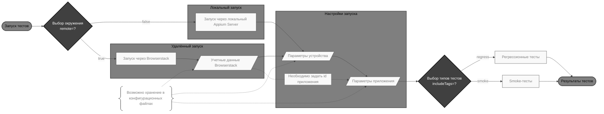

# Автоматизация тестирования Android-приложения [Wikipedia](https://www.wikipedia.org/)


## Содержание

* [Описание](#описание)
* [Технологии и инструменты](#технологии-и-инструменты)
* [Реализованные проверки](#реализованные-проверки)
* [Запуск тестов](#запуск-тестов)
  * [Локальный запуск](#локальный-запуск)
  * [Локальная конфигурация](#локальная-конфигурация)
* [Сборка в Jenkins](#сборка-в-jenkins)
* [Интеграция с Allure Report](#интеграция-с-allure-report)
* [Интеграция с Allure TestOps](#интеграция-с-allure-testops)
* [Уведомления в Telegram](#уведомления-в-telegram)
* [Видео выполнения теста](#видео-выполнения-теста)
* [Правовая информация](#правовая-информация)

## Описание

**Википедия** — многоязычная общедоступная интернет-энциклопедия со свободным контентом. Является самым крупным и наиболее читаемым справочником, а также самой полной энциклопедией из когда-либо создававшихся за всю историю человечества.

### Особенности проекта

* **Современная архитектура тестов**
  * Использован шаблон проектирования *Page Object* для поддержки чистоты и переиспользуемости кода;
  * Конфигурации написаны с использованием библиотеки [Owner](https://github.com/matteobaccan/owner), что обеспечивает гибкость и удобство настройки окружений.

* **Кастомные расширения для тестов**
  * `@Layer`, `@Manual` — интеграция с Allure TestOps для категоризации тестов.

* **Мобильная специфика**
  * Тестирование Android-приложения с использованием [Appium](https://appium.io/);
  * Запуск на реальных устройствах и эмуляторах.

* **Удобные сценарии запуска**
  * Локальный и удалённый запуск;
  * Фильтрация тестов по тегам;
  * Возможность запуска напрямую из Allure TestOps.

* **CI/CD-процессы**
  * При каждом пуше в основные ветки и перед мержем пулл-реквестов запускается сборка проекта в GitHub Actions.

* **Интеграция с Allure**
  * После прохождения автотестов формируется наглядный Allure-отчет:
    * Шаги выполнения;
    * Скриншот страницы перед завершением теста;
    * Видео прохождения сценария;
    * HTML-код страницы и логи браузера.
  * Результаты автоматически синхронизируются с Allure TestOps.

* **Уведомления о результатах**
  * Итоги тестового прогона отправляются в Telegram-чат с помощью библиотеки [Allure notifications](https://github.com/qa-guru/allure-notifications).

## Технологии и инструменты

<p align="center">
<a href="https://www.jetbrains.com/idea/"></a>
<a href="https://developer.android.com/studio"></a>
<a href="https://www.java.com/"></a>
<a href="https://junit.org/junit5/"></a>
<a href="https://selenide.org/"></a>
<a href="https://appium.io/"></a>
<a href="https://gradle.org//"></a>
<a href="https://git-scm.com/"></a>
<a href="https://github.com/"></a>
<a href="https://www.jenkins.io/"></a>
<a href="https://www.browserstack.com/"></a>
<a href="https://allurereport.org/"></a>
<a href="https://qameta.io/"></a>
<a href="https://telegram.org/"></a>
</p>

* **Среда разработки**
  * [Intellij IDEA](https://www.jetbrains.com/idea/)
  * [Android Studio](https://developer.android.com/studio)

* **Язык программирования**
  * [Java](https://www.java.com/)

* **Фреймворки для тестирования**
  * [JUnit 5](https://junit.org/) — современный тестовый фреймворк с поддержкой аннотаций, параметризации и расширений
  * [Selenide](https://selenide.org/) — лаконичная обёртка над Selenium WebDriver для UI-тестов
  * [Appium](https://appium.io/) — инструмент для автоматизации тестирования мобильных приложений

* **Сборка и управление зависимостями**
  * [Gradle](https://gradle.org) — сборка, управление зависимостями и настройка запуска тестов

* **Контроль версий и репозиторий**
  * [Git](https://git-scm.com/) — система контроля версий
  * [GitHub](https://github.com/) — хостинг и управление проектом

* **Инфраструктура и CI/CD**
  * [GitHub Actions](https://github.com/features/actions) — автоматизация рабочих процессов и CI/CD в GitHub
  * [Jenkins](https://www.jenkins.io/) — автоматизация прогонов тестов, формирование отчётов и интеграция с внешними сервисами
  * [Browserstack](https://www.browserstack.com/) — облачная платформа для запуска тестов на реальных устройствах

* **Отчётность и интеграции**
  * [Allure Report](https://allurereport.org/) — детализированные отчёты о тестовых прогонах
  * [Allure TestOps](https://qameta.io/testops/) — управление тестами и аналитика результатов
  * [Telegram](https://core.telegram.org/bots) — интеграция через бота для оперативных уведомлений о статусе прогонов

## Реализованные проверки

<details>
   <summary>UI</summary>

**Онбординг:**
- [x] Проверка содержимого всех фрагментов онбординга
- [x] Переход между фрагментами онбординга свайпами
- [x] Нажатие кнопки "Back" закрывает онбординг
- [x] Нажатие кнопки "Skip" закрывает онбординг
- [x] Нажатие кнопки "Get started" закрывает онбординг
- [x] Онбординг не открывается после пропуска при повторном запуске приложения
- [x] Онбординг не открывается после завершения при повторном запуске приложения

**Поиск:**
- [x] Ввод поискового запроса с проверкой наличия результатов
- [x] Открытие статьи из результатов поиска
</details>

<details>
   <summary>Ручные проверки</summary>

**Авторизация:**
- [x] Авторизация с валидными данными
- [x] Авторизация с несуществующим логином
</details>

## Запуск тестов



```bash
gradle clean test -Premote={true|false} -PincludeTags={tags} -Ddevice={device} \
  -Dremote.domain={domain} -Dremote.username={username} -Dremote.access_key={access_key} -Dproject.name={project_name} \
  -Dapp.id={id} -Dapp.package={package} -Dapp.activity={activity}
```

* `remote` — выбор окружения (опционально):
  * `true` — запуск тестов через Browserstack
  * `false` — запуск тестов через локальный Appium Server (по умолчанию)
* `device` — предопределенная конфигурация устройства (опционально):
  * `device1`, `device2`
  * по умолчанию `default`
* `remote.*` (только для `remote=true`) — данные для авторизации в Browserstack:
  * `domain` — домен (по умолчанию `hub.browserstack.com`)  
  * `username` — логин пользователя Browserstack
  * `access_key` — ключ доступа пользователя Browserstack
  * `project.name` (только для `remote=true`) — название проекта в Browserstack
* `app.*` — данные тестируемого приложения:
  * `id` (только для `remote=true`) — id приложения в Browserstack, которое будет устанавливаться на устройство
  * `package` — имя пакета приложения (по умолчанию `org.wikipedia.alpha`)
  * `activity` — название стартовой Activity приложения (по умолчанию `org.wikipedia.main.MainActivity`)
* `includeTags` — теги тестов для запуска (можно комбинировать, см. [документацию JUnit](https://docs.junit.org/current/user-guide/#running-tests-tag-expressions)):
  * `regress` — регрессионные тесты
  * `smoke` — smoke-тесты

Минимальный набор параметров для запуска через Browserstack:

```bash
gradle clean test -Premote=true -Dremote.username={username} -Dremote.access_key={access_key} -Dapp.id={id}
```

<details>
   <summary>Дополнительные команды</summary>

1. Формирование Allure-отчёта:
   ```bash
   gradle allureReport
   ```
   По умолчанию отчёт генерируется в папку `build/allure-results`.

2. Формирование Allure-отчёта, запуск локального HTTP-сервера и открытие в браузере:
   ```bash
   gradle allureServe
   ```
</details>

### Локальный запуск

1. Установить [Android Studio](https://developer.android.com/studio) и настроить переменные среды
2. Открыть `Virtual Device Manager` и создать эмулятор с требуемыми свойствами
3. Установить [Node.js](https://nodejs.org/en/download)
4. Установить [Appium](https://appium.io/docs/en/2.0/quickstart/install/) через `npm`
   ```bash
   npm i -g appium
   ```
5. Установить [UiAutomator2 Driver](https://appium.io/docs/en/2.0/quickstart/uiauto2-driver/)
   ```bash
   appium driver install uiautomator2
   ```
6. Запустить Appium Server
   ```bash
   appium server --base-path /wd/hub
   ```
7. Запустить эмулятор
8. Запустить тесты

### Локальная конфигурация

Для упрощения локального запуска можно создать файлы `remote/browserstack.properties`, `remote/local.properties`, `app/app.properties`, `devices/local.{device_name}.properties` и `devices/browserstack.{device_name}.properties` в корневой папке `config`.

В папке есть шаблоны: [browserstack.example.properties](/config/remote/browserstack.example.properties), [local.example.properties](/config/remote/local.example.properties), [browserstack.device.example.properties](/config/devices/browserstack.device.example.properties), [local.device.example.properties](/config/devices/local.device.example.properties), [app.example.properties](/config/app/app.example.properties). Необходимо скопировать их, убрав из имени `.example`, и заполнить своими данными.

Минимальный набор параметров для локального запуска, если настроена локальная конфигурация:
```bash
gradle clean test
```

## Сборка в [Jenkins](https://jenkins.autotests.cloud/job/C36-NeverFlyDog-Wikipedia/)

[Jenkins](https://www.jenkins.io/) — инструмент для автоматизации сборки, тестирования и деплоя проектов.

В проекте используется для:
* удалённого запуска автотестов,
* формирования Allure-отчётов по результатам прогонов,
* интеграции с уведомлениями в Telegram.

На странице проекта доступна информация о последних сборках и график успешности прохождения тестов из Allure-отчёта:


Раздел `Build with Parameters` позволяет задать необходимые параметры перед запуском сборки:


После завершения сборки автоматически формируется Allure-отчёт, и обновляются результаты прохождения тестов в Allure TestOps.

## Интеграция с [Allure Report](https://jenkins.autotests.cloud/job/C36-NeverFlyDog-Wikipedia/allure/)

[Allure Report](https://allure.qatools.ru/) — инструмент для визуализации результатов тестов, который формирует наглядные и подробные отчёты.

В проекте используется для:
* отображения шагов выполнения теста,
* демонстрации скриншотов и видео,
* анализа логов и исходного кода страницы,
* отслеживания успешных и упавших тестов.

Во вкладке `Overview` отображается общий результат прогона тестов: диаграммы успешных и упавших тестов, распределение по сьютам и функциональным фичам:


При переходе в конкретный тест доступны подробности — шаги теста, скриншоты, видео и логи браузера:


## Интеграция с [Allure TestOps](https://allure.autotests.cloud/project/4942/)

[Allure TestOps](https://qameta.io/testops/) — облачная платформа для управления тестами и анализа результатов.

В проекте используется для:
* хранения тест-кейсов,
* группировки тестов по функциональностям и пользовательским историям,
* отслеживания выполнения тестов в динамике,
* интеграции с Jenkins и отчетами Allure.

Интеграция с Jenkins позволяет запускать выбранные тесты и отслеживать их выполнение в реальном времени:


Прогоны тестов отображаются на графиках и диаграммах, что позволяет быстро оценивать динамику и стабильность тестов:


Тестовые сценарии автоматически синхронизируются с кодом проекта после завершения прогонов, обеспечивая актуальность кейсов:


## Уведомления в Telegram

Результаты тестового прогона автоматически отправляются в Telegram-чат, что позволяет оперативно отслеживать статус прогонов и быстро реагировать на падения тестов:


## Видео выполнения теста

Для каждого теста в отчёте прилагается видео прохождения, позволяя визуально проверить выполнение шагов и воспроизвести возможные ошибки:


## Правовая информация

Все названия продуктов, логотипы и изображения (включая материалы сайта wikipedia.org и приложения Wikipedia, которые используются в тестах) использованы исключительно в образовательных и демонстрационных целях. Все права принадлежат их законным владельцам.
